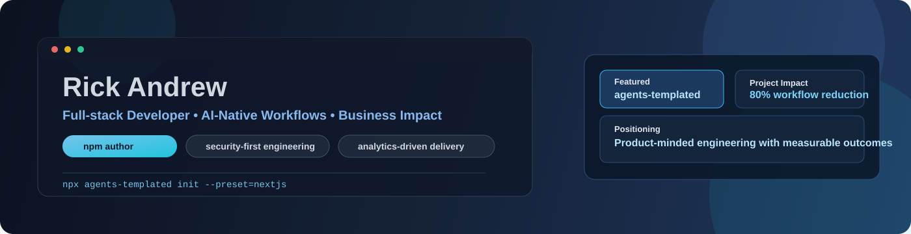
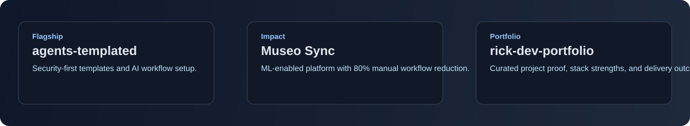

<p align="center">
	
</p>

# Rick Andrew

Full-stack developer building business-focused software, AI-assisted workflows, and developer tooling that ships with measurable outcomes.

[Portfolio](https://rick-dev-portfolio.vercel.app) | [NPM](https://www.npmjs.com/package/agents-templated) | [LinkedIn](https://linkedin.com/in/rick-andrew-macapagal-0b55982a2) | [Email](mailto:rickandrew.macapagal@gmail.com)

<p align="left">
	
</p>

<p align="left">
	<a href="https://rick-dev-portfolio.vercel.app/">
		
	</a>
	<a href="https://www.npmjs.com/package/agents-templated">
		
	</a>
	<a href="https://linkedin.com/in/rick-andrew-macapagal-0b55982a2">
		
	</a>
</p>

---

## Snapshot

- Published and actively maintaining [agents-templated](https://github.com/rickandrew2/agents-templated), a CLI template system for security-first and AI-assisted development workflows.
- Built an ML-powered museum platform that reduced manual workflows by **80%** through automation, analytics, and role-based operations.
- Focused on full-stack delivery where product decisions, implementation, and business impact stay aligned.

## Profile Highlights

<p>
	
	
	
	
</p>

---

## Featured Work: agents-templated

### [agents-templated](https://github.com/rickandrew2/agents-templated)

An enterprise-ready development template and CLI built to reduce setup friction and enforce high-quality engineering defaults across stacks.

**What it solves**
- Standardizes project bootstrapping for teams that want security, testing, and architecture discipline from day one.
- Bakes in AI assistant guidance, scoped skills, and deterministic workflows.
- Supports multiple presets while staying technology-agnostic.

**Quick commands**
```bash
npx agents-templated init --preset=nextjs
npx agents-templated init --preset=django-react
npx agents-templated wizard
npx agents-templated validate
```

[](https://www.npmjs.com/package/agents-templated)
[](https://www.npmjs.com/package/agents-templated)
[](https://github.com/rickandrew2/agents-templated)

---

## Selected Projects

<p align="center">
	
</p>

| Project | Impact | Stack | Link |
|---|---|---|---|
| Museo Sync Management System | Reduced manual museum workflows by **80%** with ML-driven operations and multilingual AI support. | React, Node.js, FastAPI, MongoDB, scikit-learn | [Live Demo](https://museo-de-malaquing-tubig.vercel.app/) |
| GIS Cemetery Management Platform | Delivered geospatial workflows with map-driven operations and role-based process controls. | TypeScript, NestJS, PostGIS, Mapbox GL | [Portfolio Case](https://rick-dev-portfolio.vercel.app) |
| Rick Dev Portfolio | Personal portfolio presenting selected projects, technical capabilities, and delivery outcomes in one place. | Next.js, TypeScript, Tailwind CSS | [View Portfolio](https://rick-dev-portfolio.vercel.app/) |

---

## GitHub Signals

<p align="left">
	
	
</p>

---

## Core Stack

**Frontend:** React, Next.js, TypeScript, Tailwind CSS, Framer Motion  
**Backend:** Node.js, Express, NestJS, FastAPI, REST APIs  
**Data:** PostgreSQL, PostGIS, MongoDB Atlas, MySQL  
**AI and Analytics:** OpenAI API, scikit-learn, pandas, predictive analytics  
**Delivery:** GitHub, Docker, Vercel, Render, Jest

---

## How I Work

- Build for outcomes, not just feature completion.
- Prioritize secure defaults, maintainable architecture, and testable logic.
- Use AI-native workflows to accelerate delivery without lowering quality.
- Keep communication clear for both technical and business stakeholders.

---

## Professional Background

I started with small web builds, moved into production systems during internship work, then shipped a public CLI package to help developers scale quality workflows faster. I am currently completing an Information Technology degree with a Business Analytics focus while working on product-minded full-stack engineering with measurable impact.

---

## Career Milestones

- **2022-2024:** Built foundational web projects and focused on practical delivery.
- **2025:** Worked on production systems during internship at Tech Executive Labs.
- **2025:** Delivered Museo Sync and supported an **80% workflow reduction** target.
- **2026:** Published `agents-templated` and began active open-source maintenance.

---

## Current Focus

- Building reusable developer tooling that improves team delivery quality.
- Shipping full-stack systems that combine analytics with operational workflows.
- Integrating AI features with strong validation, reliability, and security defaults.
- Growing in roles where engineering execution is directly tied to business value.

---

## Collaboration Style

- I value clear requirements, visible progress, and measurable outcomes.
- I adapt quickly across frontend, backend, and data layers when priorities shift.
- I communicate technical tradeoffs in language both engineers and stakeholders can use.

---

## Open To

- Full-stack development opportunities
- AI integration and workflow automation projects
- Product engineering roles that value both technical depth and business impact

---

## Domain Focus

- Developer productivity and internal tooling
- Operational platforms with analytics visibility
- Applied AI features tied to real workflows

---

## Tech Toolkit

<p>
	
	
	
	
	
	
	
	
	
</p>

---

## Contact

- Email: [rickandrew.macapagal@gmail.com](mailto:rickandrew.macapagal@gmail.com)
- LinkedIn: [Rick Andrew Macapagal](https://linkedin.com/in/rick-andrew-macapagal-0b55982a2/)
- Portfolio: [rick-dev-portfolio.vercel.app](https://rick-dev-portfolio.vercel.app)
- NPM: [agents-templated](https://www.npmjs.com/package/agents-templated)
